# Machine Learning

## What's machine learning?

Looking for function

- Speech Recognition $\rightarrow f(AUDIO)=$  "How are you?"
- Image Recognition

## Different types of Functions

This course focuses on **Deep Learning**

### Concepts (Tasks of machine learning)

#### Regression

The function outputs a scalar.

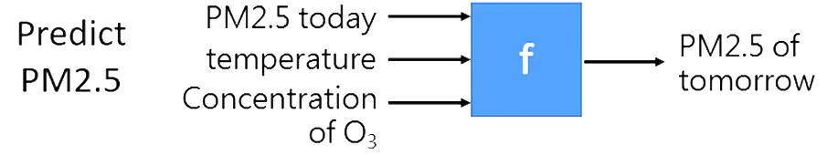

#### Classification

Given options (classes), the function outputs the correct one.

#### Structured Learning

Create something with structure (image, document).

Do compose.

### Get the function (Training | Linear)

#### 1. Function: with unknown parameters (Model)

A given out function like $y=b+wx_1$ is based on domain knowledge.

##### Variables

###### Parameters we have known

`y, x` : feature

###### Unknown Parameters (learned from data)

`w` : weight

`b` : bias

#### 2. Define Loss (from Training Data)

Loss is a function of parameters: defines how good a set of values is.
$$
L(b,w)
$$
$L(0.5k,1)\space y=b+wx_1 \rightarrow y=0.5k+1x_1$ How good it is?

Evaluate it from dataset, like this.

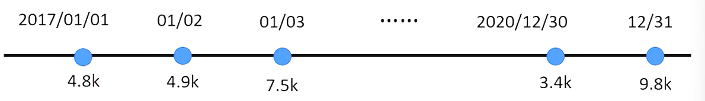

$0.5k+1x_1=y\sim5.3k(Prediction)$

$0.4k(Label,CorrectValue)$

$e_1:(5.3k-0.4k),e=|y-y\sim|$
$$
Loss:\space L=\frac{1}{N} \underset{n}\sum e_n
$$

##### MAE & MSE

$$
e=|y-\overset{\sim}y|\\L\space is\space mean\space absolute\space error \space(MAE)\\
e=(y-\overset{\sim}y)^2\\L\space is\space mean\space square\space error \space(MSE)
$$

##### Cross-entropy

Loss function for this case: $y$ and $\overset{\sim}y$ are both probability **distributions**.

##### Error Surface

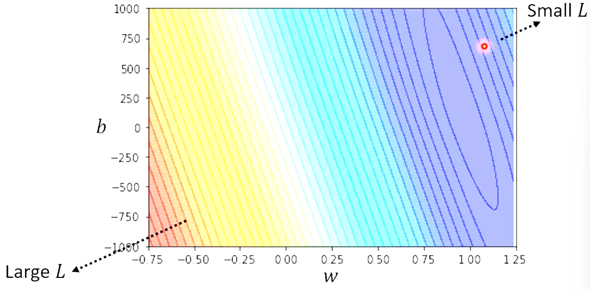

#### 3. Optimization

Find a set of values of variables: $w,b$ that make $L$ smallest.
$$
Model: y=b+wx_1\\w^*,b^*=arg\space\underset{w,b}min L
$$

##### Solution: Gradient Descent

##### 1 parameter

###### Procedure

If the unknown variable is only $w$:

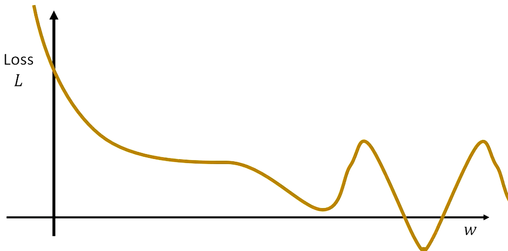

- (Randomly) Pick an initial value $w^0$

- Compute $\frac{dL}{dw}|_{w=w^0}$

  - If negative

    - Increase w

  - If positive

    - Decrease w

  - Strip

    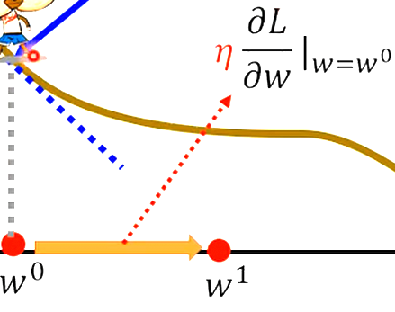

    - The $stride(w^1-w^0)$ is influenced by:
      - $Slope$ of the point: the $slope$ higher, the $\eta$ is higher.
      - $\eta$: Learning rate: Hyperparameters (tuning parameters, set by human)
    - $w_1\leftarrow w^0-\eta\frac{dL}{dw}|_{w=w^0}$

- Update $w$ iteratively

- Time to stop ($w$ will not be updated)

  1. Up to max trying frequency.
  2. $\frac{dL}{dw}|_{w=w^0}=0$

##### 1+ parameters

###### Procedure

- (Randomly) Pick an initial value $w^0$

- Compute $\frac{dL}{dw}|_{w=w^0,b=b^0} \space \space \space \space\& \space \space \space \space\ \frac{dL}{db}|_{w=w^0,b=b^0}$

  - $w_1\leftarrow w^0-\eta\frac{dL}{dw}|_{w=w^0,b=b^0}$

  - $b_1\leftarrow b^0-\eta\frac{dL}{db}|_{w=w^0,b=b^0}$

    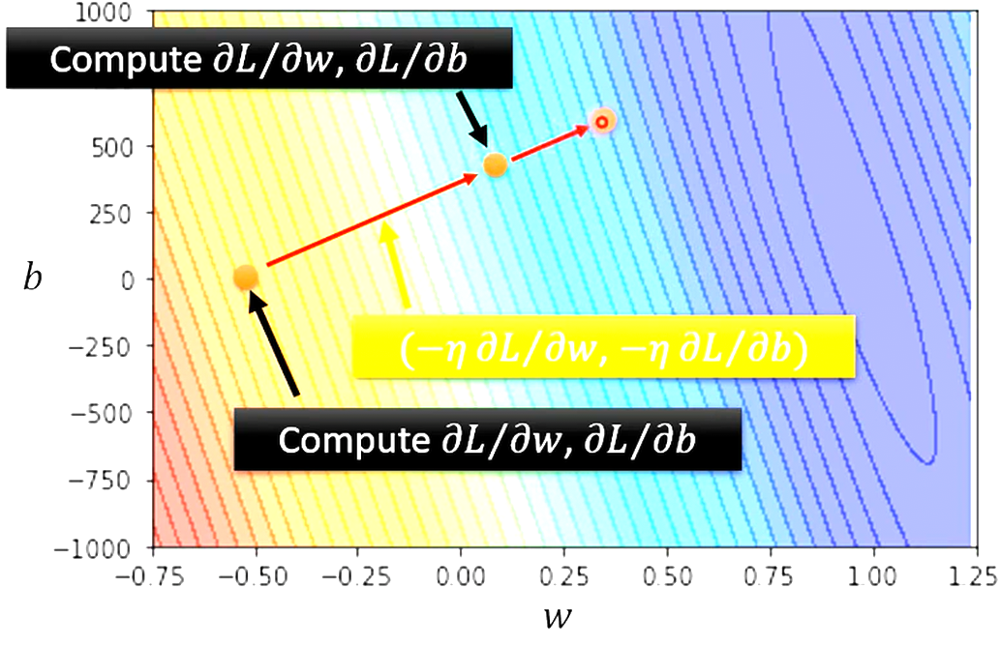

> Can be done in one line in most deep learning frameworks.

- Update...

###### Problems

###### Global minima & Local minima

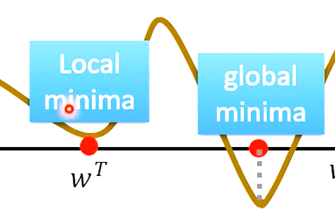

Does local minima truly case the problem?

#### Summary

The prediction is useless: we have known the actual result and just **training** the model.

Use the training data to estimate the unknown result...

And the function model may not be linear...

##### Model Bias

Linear models have severe limitation!

We need a more flexible model!

### Get the function (Training | Curve)

red curve = constant + sum of **a set of** blue curve

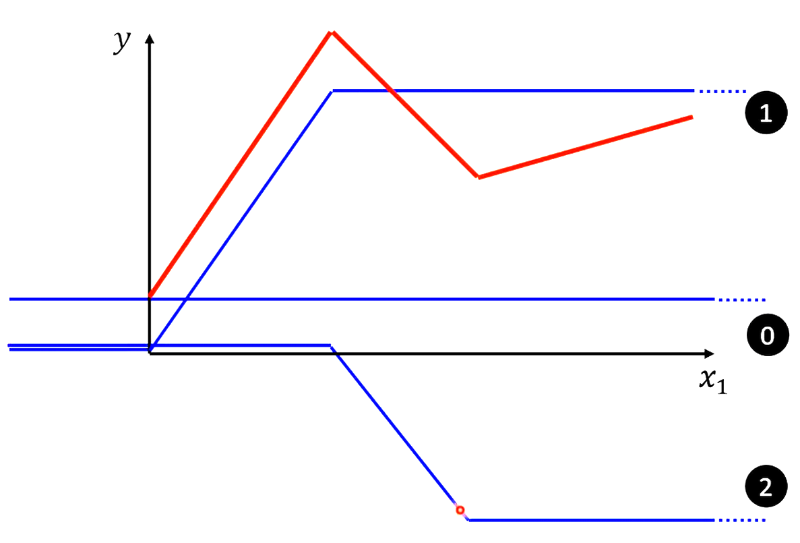

#### All Piecewise Linear Curves

Piecewise linear curves = constant + sum of a set of blue curve

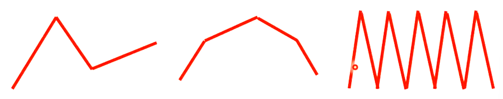

So, more pieces require more blue curves.

#### Beyond Piecewise Linear

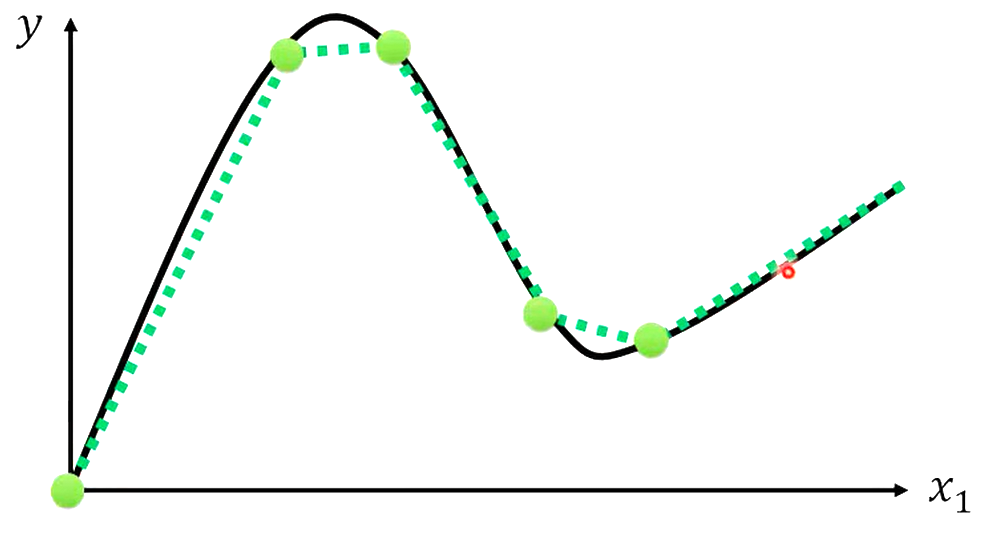

To have good approximation, we need sufficient pieces!

#### Sigmoid Function

Hard Sigmoid Function

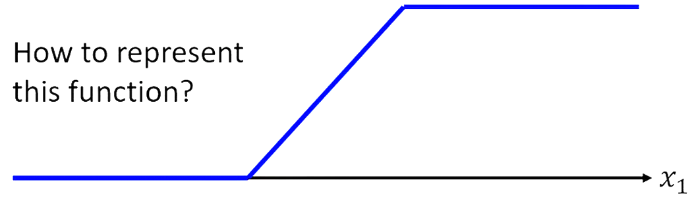

Sigmoid Function
$$
y=c\frac{1}{1+e^{-(b+wx_1)}}
$$

##### Variables

`c` Change Height

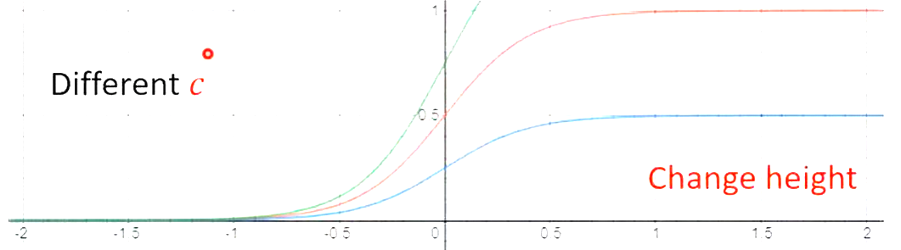

`b` Define Shift

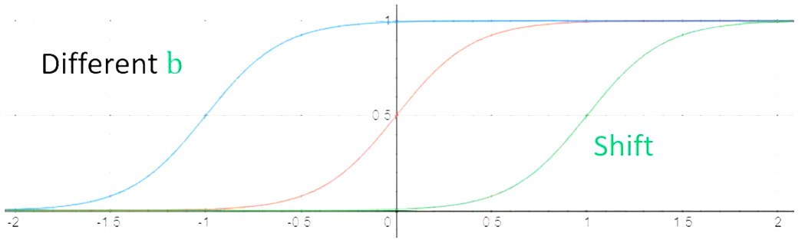

`w ` Define Slopes

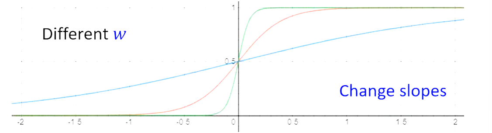

#### Get the function

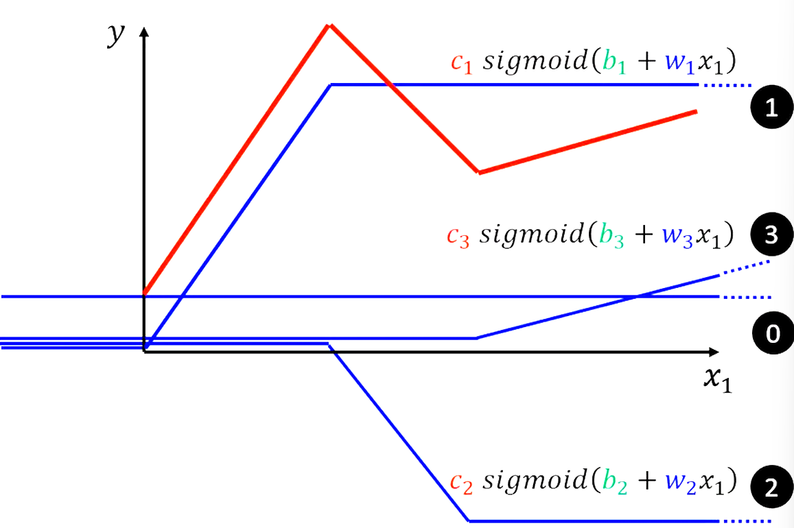

New model: More features
$$
Example\space1:y=b+wx_1 \space\downarrow\\
y=b+\underset{i}\sum c_isigmoid(b_i+w_ix_1)\\\\
Example\space2:y=b+\underset{j}\sum w_jx_j\space\downarrow\\
y=b+\underset{i}\sum c_isigmoid(b_i+\underset{j}\sum w_{ij}x_j)
$$

#### Graph

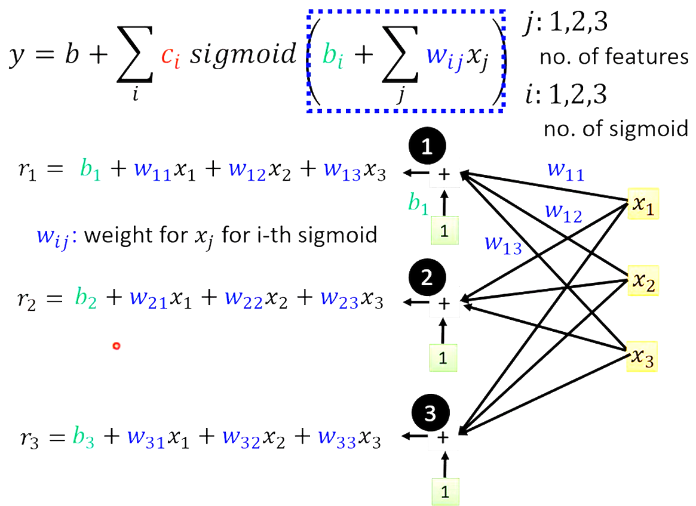

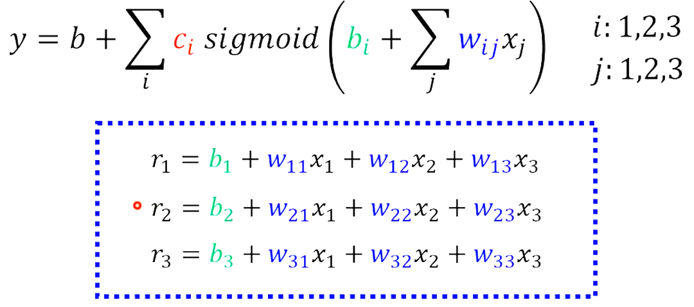

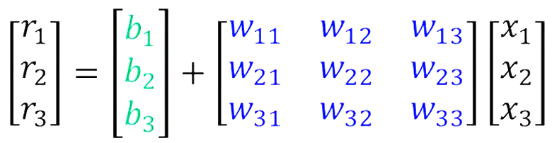

`r` = `b` + `W`  `x`

Then,

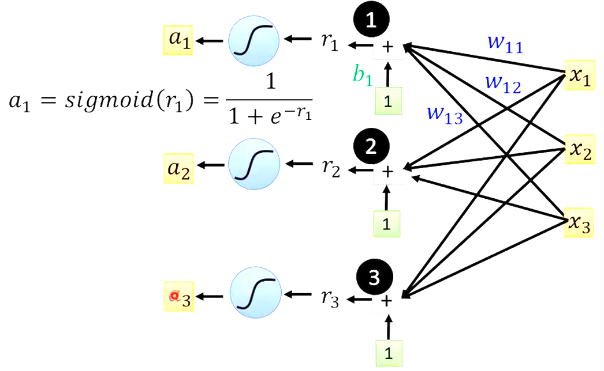
$$
\mathbf{a}=\sigma(r)
$$
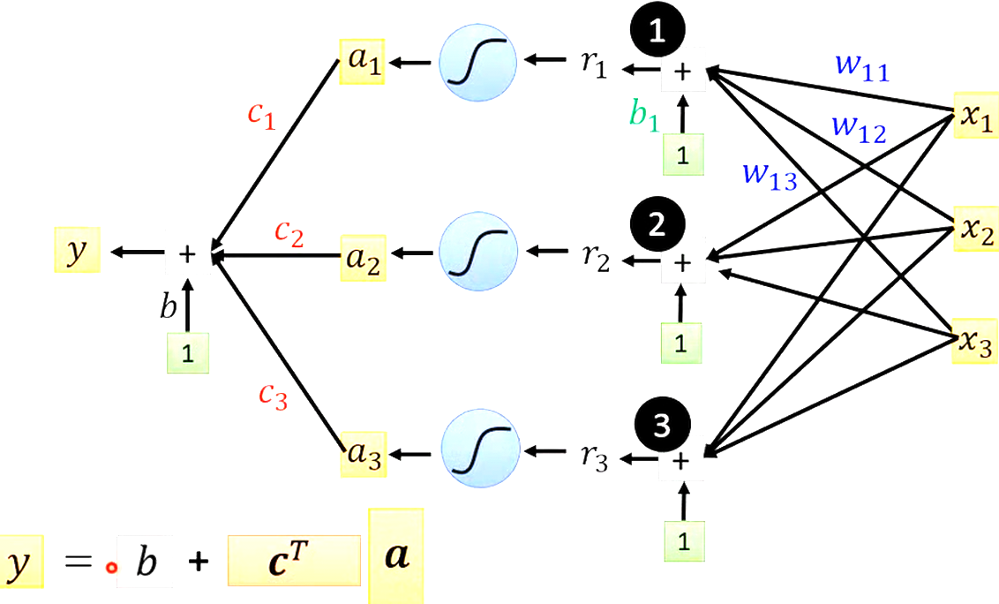
$$
y=b+c^T\mathbf{a}\\
y=b+c^T\sigma(\mathbf{b}+Wx)
$$

### Input

- Vector `beep` `number`
- Matrix (Image)
- Sequence (Speech, Text)
- ...

To Function

### Output

- Regression `number prediction`
- Classification
- Text
- Image
- ...

## Supervised Learning (Lecture 1-5) `Foundation Model`

### Pokemon or Digimon Recognition

#### 1. Training Data

Image + Labels

#### 2. Train

## Self-Supervised Learning (Lecture 7)

### Develop general purpose Knowledge

#### Unlabeled Images

From Internet, no labels

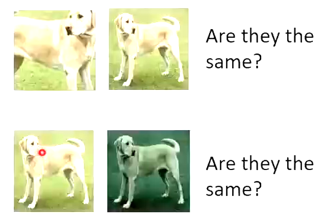

## Rel: Pre-trained Model vs. Downstream Tasks

Pre-trained Model : Operating System

Downstream Tasks: Applications

## Generative Adversarial Network (Lecture 6) `Unsupervised`

x -> Function -> y

x1, x2, ……

y1, y2, ……

***You need not provide the relationships with each label.***

## Reinforcement Learning (RL)

It is challenging to label data in some tasks.

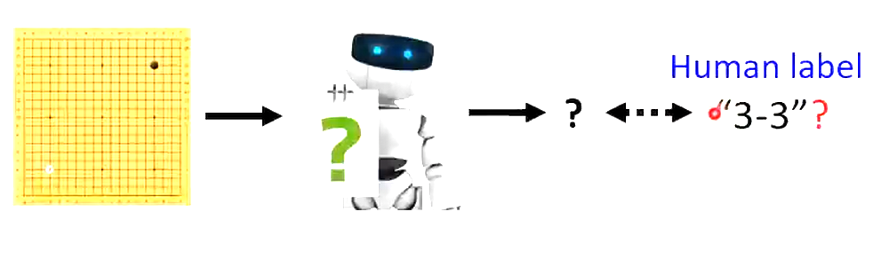

We can know the results are good or not. (Win or Lose)

## Anomaly Detection (Lecture 8) `Self-Reflection`

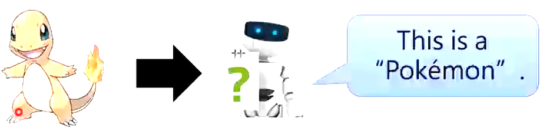

We hope our model to have this ability:

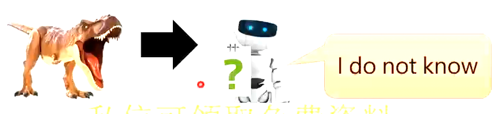

## Explainable AI (Letcure 9) `Why does the model know the answer?`

Lighten the important parts for recognizing.

……？

## Model Attack (Lecture 10)

Add some noise to image, the result may be affected...

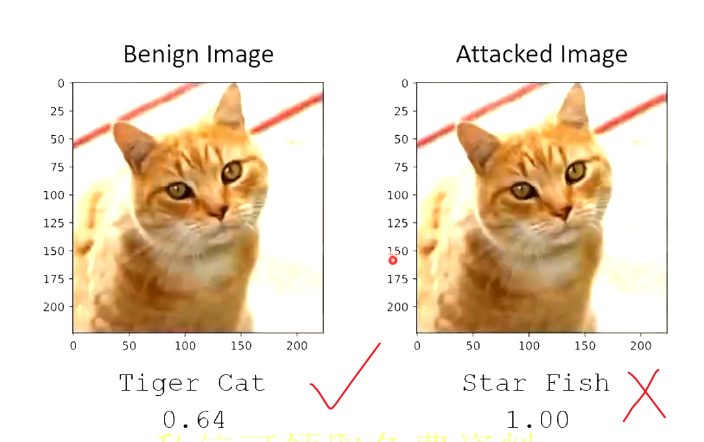

## Domain Adaptation (Lecture 11)

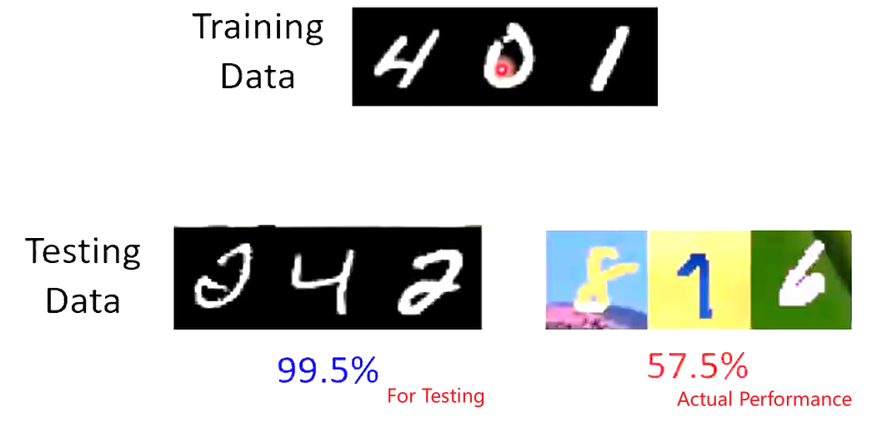

## Network Compression (Lecture 13)

Deploying ML models in resource-constrained environments... 📱⌚

## Life-long Learning (Lecture 14)

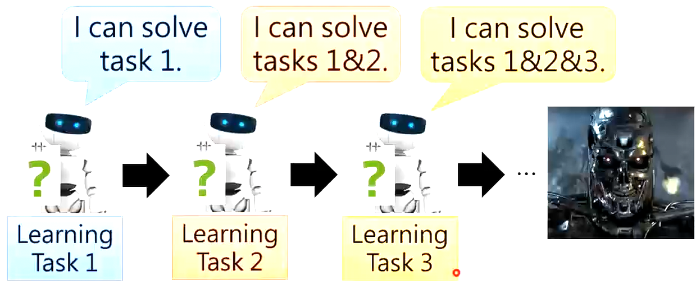

This is the target of life-long learning. What's the challenge?

# Meta Learning = Learn to Learn

## Meta Learning (Lecture 15)

### Before

People designed algorithm

### After

By machine self instead of by people designed

**Few-shot learning** is usually achieved by meta-learning.