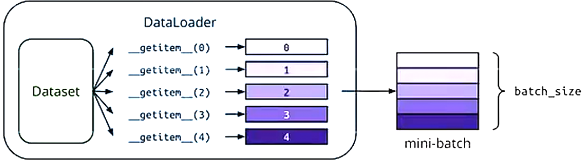
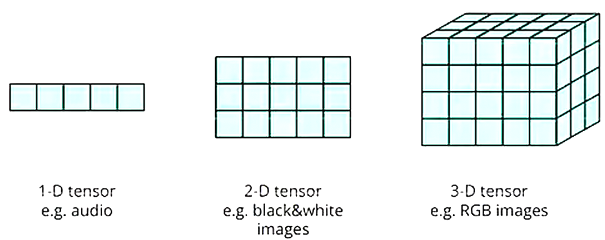
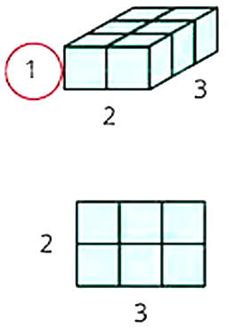
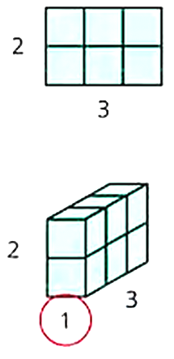
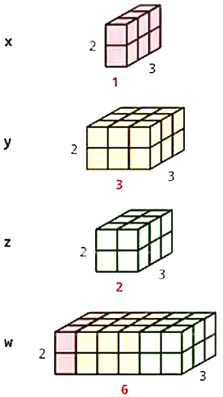
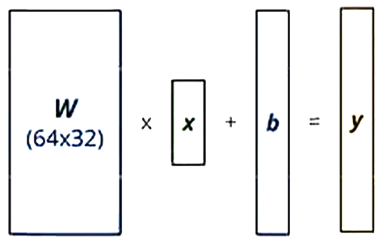
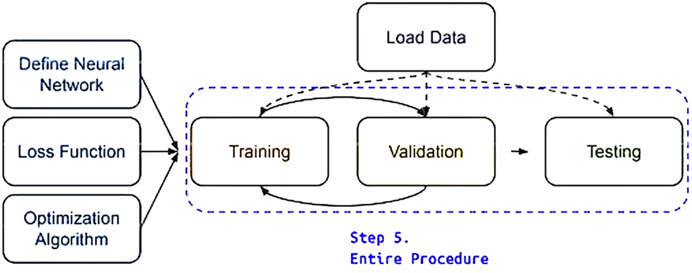

# Lecture 0 PyTorch Tutorial

# Dataset & Dataloader

Dataset: stores data samples and expected values

Dataloader: groups data in batches, enables multiprocessing.

```py
dataset = MyDataset(file)
dataset = DataLoader(dataset, batch_size, shuffle=True)
```

```python
from torch.utils.data import Dataset, DataLoader
class MyDataset(Dataset):
    def __init__(self,file):
		# Read data & preprocess
        self.data = ...
    def __getitem__(self, index)
    	# Returns one sample at a time
        return self.data[index]
    def __len__(self):
        return len(self.data)
```



> Merge is done by torch

### CSV Files

Use **pandas** to load a csv file.

```py
train_data = pd.read_csv('./covid.train.csv').drop(columns=['date']).values
x_train, y_train = train_data[:,:-1], train_data[:,-1]
```

### Dataset Methods

`__init__`

`__getitem__`

`__len__`

# Tensors

- High-dimensional matrices (arrays)



```py
.shape()
```

## Creating Tensors

### Directly from data (list or numpy.ndarray)

```py
x = torch.tensor()
x = torch.from_numpy(np.array())
```

### Tensor of constant zeros & ones

```py
x = torch.zeross([2, 2])
# tensor([[0.,0.],[0.,0.]])
x = torch.ones([1, 2, 5])
# tensor([[[1.,1.,1.,1.,1.],[1.,1.,1.,1.,1.]]])
```

### Common Operations

Addiction

Subtraction

Power

Summation

Mean

...

#### Transpose (2x3->3x2)

```py
x = torch.zeros([2,3])
x.shape # torch.Size([2,3])
x = torch.transpose(0,1)
x.shape	# torch.Size([3,2])
```

#### Squeeze (Remove the specified dimension with length = 1)

```py
x = torch.zeros([1,2,3])
x.shape # torch.Size([1,2,3])
x = x.squeeze(0)
x.shape # torch.Size([2,3])
```



#### Unsqueeze (Expand a new dimension)

```py
x = torch.zeros([2,3])
x.shape # torch.Size([2,3])
x = x.unsqueeze(1) # Dim = 1
x.shape # torch.Size([2, 1, 3])
```



#### Cat (Concatenate multiple tensors)

```py
x = torch.zeros([2, 1, 3])
y = torch.zeros([2, 3, 3])
z = torch.zeros([2, 2, 3])
w = torch.cat([x, y, z], dim=1)
w.shape # torch.Size([2,6,3])
```




### Data Type

#### torch.float

32-bit floating point

#### torch.long

64-bit integer(signed)

### Device

#### .to

Use .to() to move tensors to appropriate devices.

#### CPU

```py
x = x.to('cpu')
```

#### GPU

```py
x = x.to('cuda:0') # cuda:1, cuda:2 ...
```

# Training & Testing Neural Networks

## torch.nn - Network Layers

### Linear Layer (Fully-Connected Layer)



```py
nn.Linear(in_features, out_features)
```

```py
layer = torch.nn.Linear(32, 64)
layer.weight.shape # torch.Size([64,32])
layer.bias.shape # torch.Size([64])
```

### Sigmoid Activation

```py
nn.Sigmoid()
```

### ReLU Activation

## Build your own neural network

```py
import torch.nn as nn
class MyModel(nn.Module):
    def __init__(self):
        super(MyModel, self).__init__()
        self.net = nn.Sequential(
        	nn.Linear(10,32),
        	nn.Sigmoid(),
        	nn.Linear(32,1)
        )
    def forward(self, x):
        return self.net(x)
```

## torch.nn - Loss Function

## torch.optim

### Stochastic Gradient Descent (SGD)

```py
optimizer = torch.optim.SGD(model.parameters(),lr,momentum = 0)
```

Every batch of data:

1. Call `optimizer.zero_grad()` to reset gradients of model parameters. (Clear prior gradient we calculated)
2. Call `loss.backward()` to backpropagate gradients of prediction loss. (Back infer gradient of each layer)
3. Call `optimizer.step()` to adjust model parameters.

## Summary



```py
"""Step1.prepare training data"""
dataset = MyDataset(file)								# read data
tr_set = DataLoader(dataset, 16, shuffle=True)			# put dataset into Dataloader
model = MyModel().to(device)							# construct model and move to device(cpu/cuda)
criterion = nn.MSELoss()								# set loss function
optimizer = torch.optim.SGD(model.parameters(), 0.1)	# set optimizer

"""Step2.Train"""
for epoch in range(n_epochs):
    model.train()										# set model to train mode
    for x,y in tr_set:
        optimizer.zero_grad()							# set graident to zero
        x, y = x.to(device), y.to(device) 				# move data to device(cpu/cuda)
        loss = criterion(pred, y)						# compute loss
        loss.backward()									# compute gradient (backpropagation)
        optimizer.step()								# update model with optimizer

"""Step3.Evaluate"""
model.eval()
total_loss = 0
for x, y in dv_set:
    x, y = x.to(device), y.to(device)
    with torch.no_grad():
        pred = model(x)	# forward pass(compute output)
        loss = criterion(pred, y)	# compute loss
    total_loss += loss.cpu().item() * len(x)	# accumulate loss
    avg_loss = total_loss / len(dv_set.dataset)
```

## Save / Load Trained Models

### Save

```py
torch.save(model.state_dict(),path)
```

### Load

```py
ckpt = torch.load(path)
model.load_state_dict(ckpt)
```

# Documentation & Common Errors

[document](https://pytorch.org/docs/stable/)

## Tensor on Different Device to Model

## Mismatched Dimensions

```py
x = torch.randn(4,5)
y = torch.randn(5,4)
z = x + y
"""
Ths size of tensor a(5) must match the size of tensor b(4) at non-singleton dimension 1
"""
```

The shape of a tensor is incorrect, use **transpose**, **squeeze**, **unsqueeze** to align the dimensions.

```py
y = y.transpose(0, 1)
z = x + y
print(z.shape)
```

## CUDA Out of Memory

Reduce the batch size.

## Mismatched Tensor Type

```py
import torch.nn as nn
L = nn.CrossEntropyLoss()
outs = torch.randn(5,5)
labels = torch.Tensor([1,2,3,4,0])
lossval = L(outs, labels)
"""
Expected scalar type Longbut found Float
"""
```

Labels must be long tensors, cast it to type "Long" to fix this issue.

```py
labels = labels.long()
lossval = L(outs, labels)
print(lossval)
```

