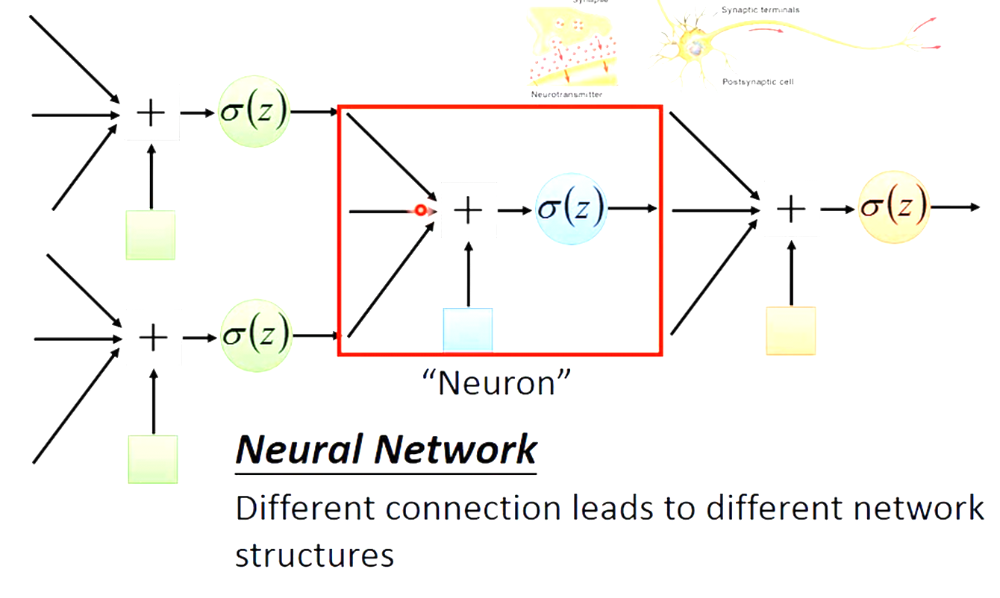
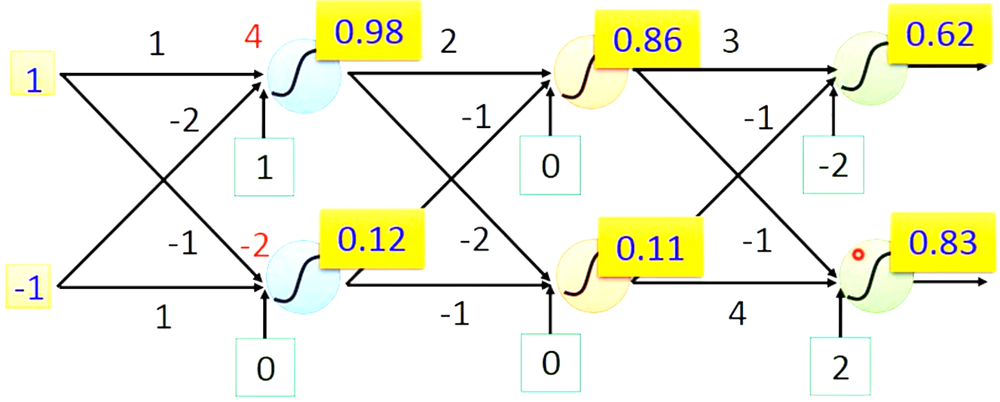
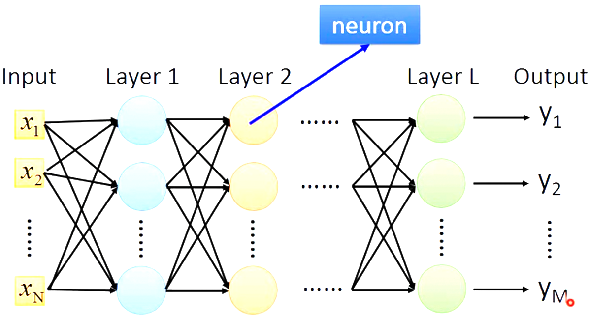
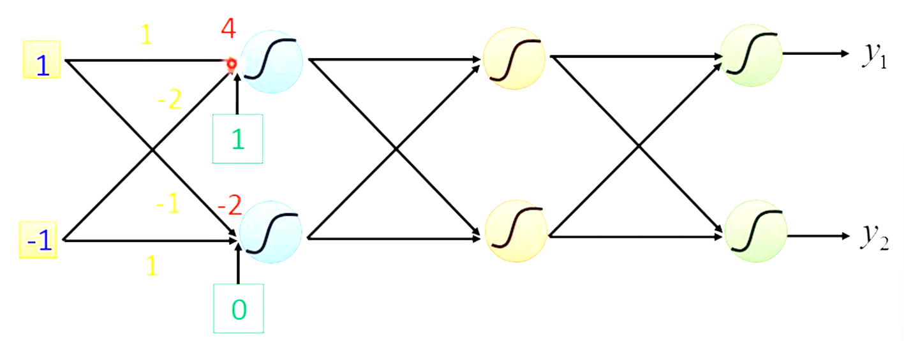

# Deep Learning

# Neural Network

Different connection leads to different network structures.



## Fully Connect Feedforward Network



Input: `vector` Output: `vector`

Given network structure, define *a function set*



```
Input	 	|			Hidden Layers		  | Output
Layer		|								  |	Layer
```

Deep = Many hidden layers

## Matrix Operation


$$
\sigma(
\left[
\begin{array}
{ccc}
	1&-2 \\
	-1&1 
\end{array} 
\right]
\left[
\begin{array}
{ccc}
	1\\-1
\end{array} 
\right]
+
\left[
\begin{array}
{ccc}
	1\\0
\end{array} 
\right]=
\left[
\begin{array}
{ccc}
	4\\-2
\end{array} 
\right])=
\left[
\begin{array}
{ccc}
	0.98\\0.12
\end{array} 
\right]
$$
`y` = f(`x`)

= $\sigma(W^L...\sigma(W^2\sigma(W^1x+b^1)+b^2)+...+b^L)$

Using parallel computing techniques to speed up matrix operation. (GPU)

## Hidden Layer

Feature extractor replacing feature engineering.

## Output Layer `Multi-class classifier` `Softmax`

## FAQ

Q: How many layers? How many neurons for each layer?

`Trail and Error` + `Intuition`

Q: Can the structure be automatically determined?

Q: Can we design the network structure?

# Loss for an Example


# # Backpropagation

# Gradient Descent

# Chain Rule

## Case 1

$$
y=g(x)\space z=h(y)\\
\Delta x\rightarrow\Delta y\rightarrow\Delta z\quad\quad \frac{dz}{dx}=\frac{dz}{dy}\frac{dy}{dx}\\
$$

## Case 2

$$
x=g(s)\space y=h(s)\space z=k(x,y)\\
\frac{dz}{ds}=\frac{\delta z}{\delta x}\frac{dx}{ds}+\frac{\delta z}{\delta y}\frac{dy}{ds}
$$

## Loss

