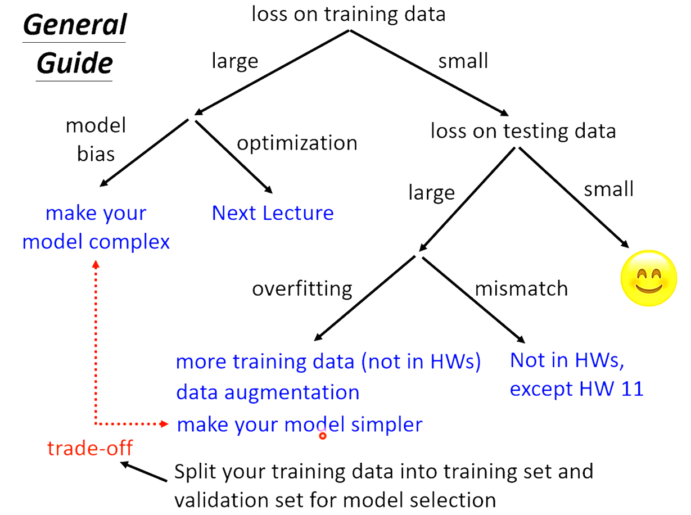
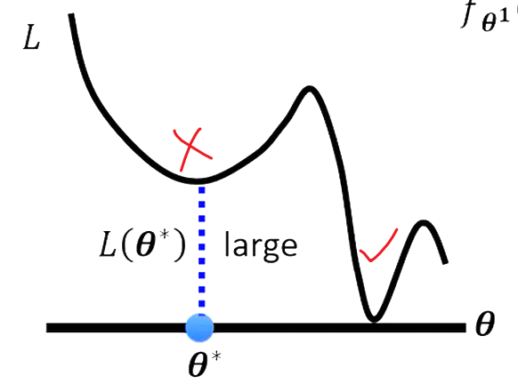
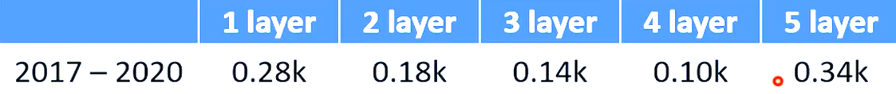
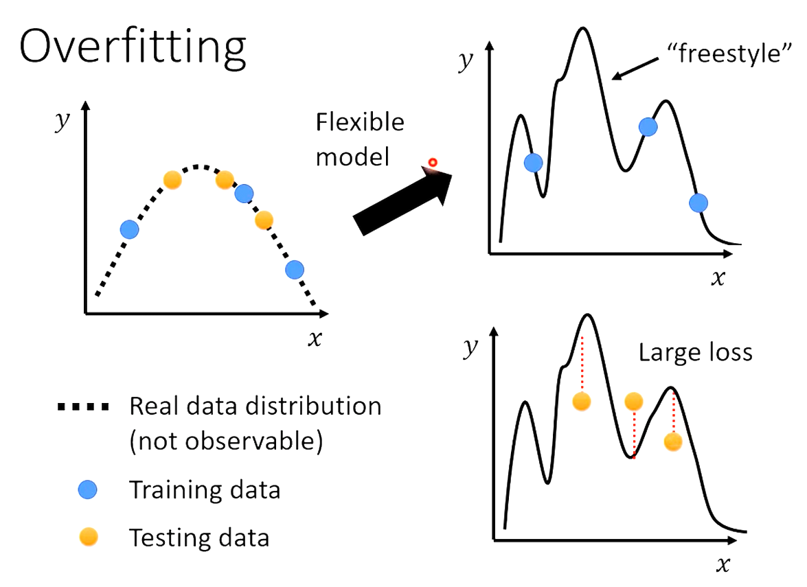
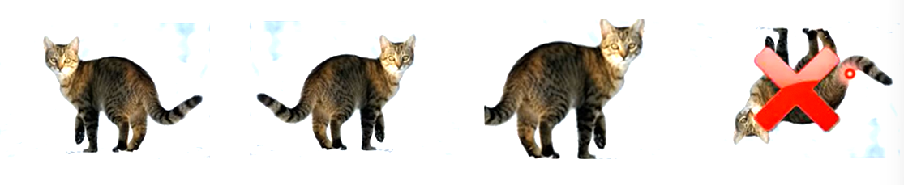
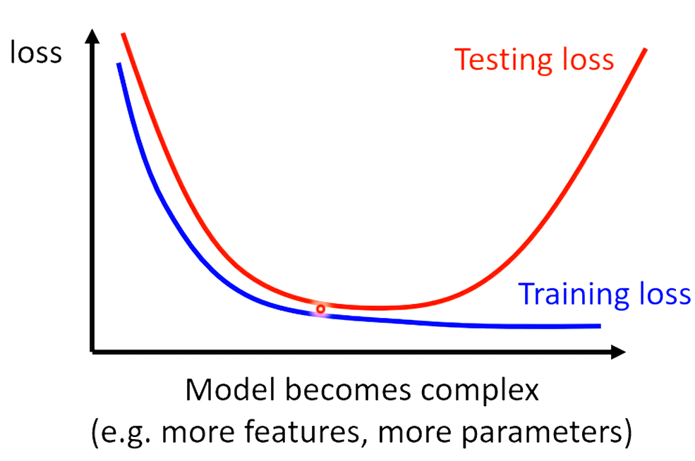
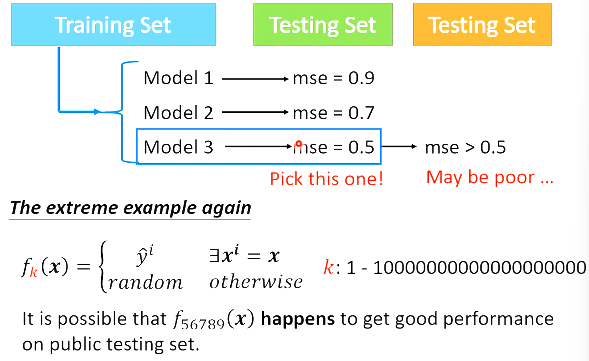
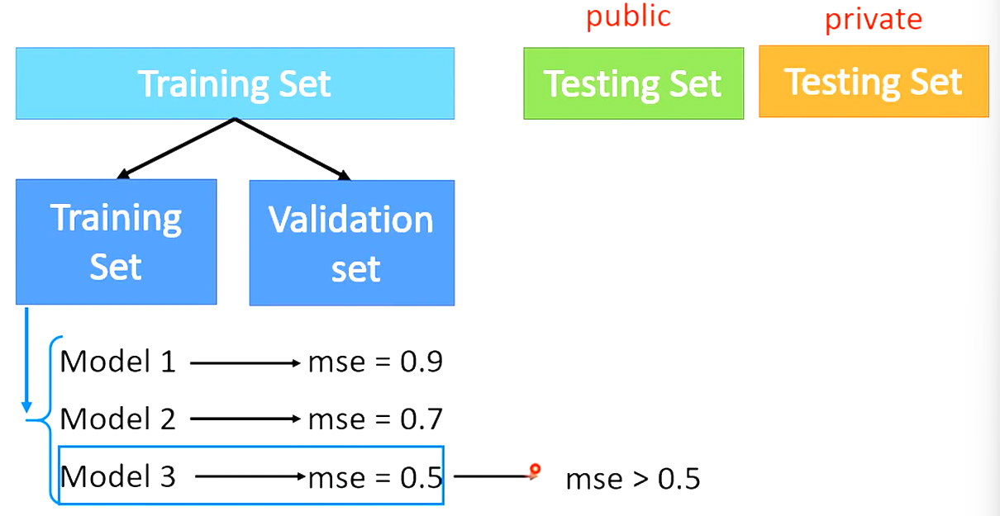
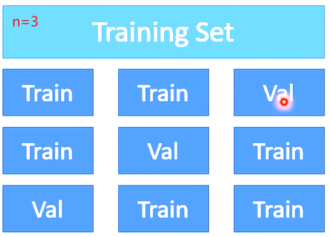
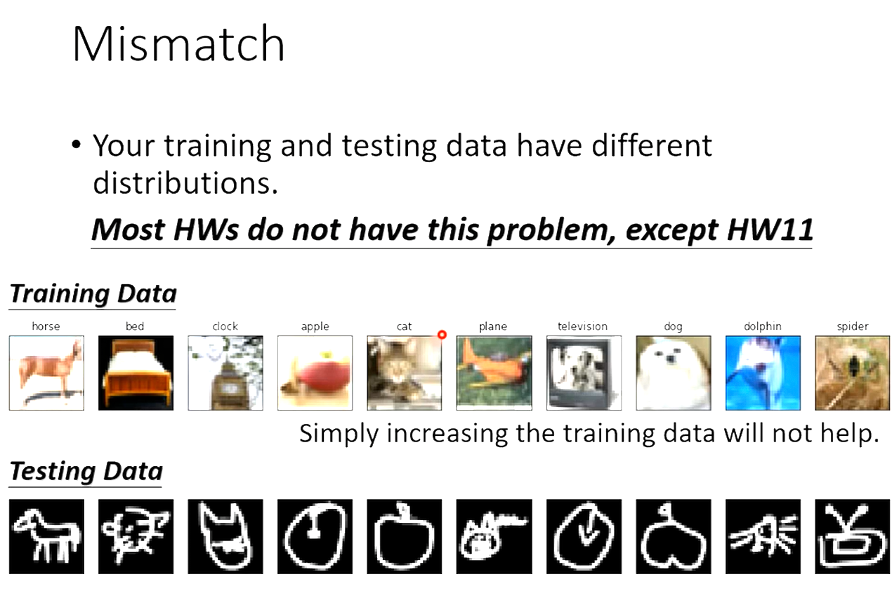

# Lecture 2 General Guidance

# Framework of ML

## Training

Step 1. function with unknown

Step 2. define loss from training data

Step 3. optimization

# General Guide

## Loss on training Data is large

### Model Bias

#### The model is too simple (flexibility is not enough)

Solution: redesign your mode to make it more flexible *more feature*

$y=b+wx_1\rightarrow y=b+\overset{56}{\underset{j=1}\sum}w_jx_j$

Deep learning (more neurons, layers)

$y=b+\underset{i}\sum c_i\space sigmoid(b_i+\underset{j}\sum w_{ij}x_j)$

### Optimization Issue (flexibility is enough, but optimization is not good)

Large loss not always imply model bias. There is another possibility...

### Which one?

### Solution

Graining the insights from **comparison**

Start from **shallower networks**, which are easier to optimize.

If deeper networks do not obtain smaller loss on **training data**, then there is optimization issue.

[More powerful optimization technology.]()

## Loss on testing data is large

### Overfitting

Small loss on **training data**, large loss on **testing data**.

#### Solution

1. More training data.

2. Data augmentation: Create more dataset..

   

3. Reduce the model flexibility. (Less parameters, sharing parameters) [Fully-connected(more flexible) & CNN(less flexible)]()

4. Less features

5. Early stopping

6. Regularization

7. Dropout

But if you reduce too much, the model will back to model bias...

## Bias-Complexity Trade-off

## Cross Validation

## N-fold Cross Validation

Use 3 sets evaluate 3 models

## Mismatch

Your training and testing data have different distributions.

